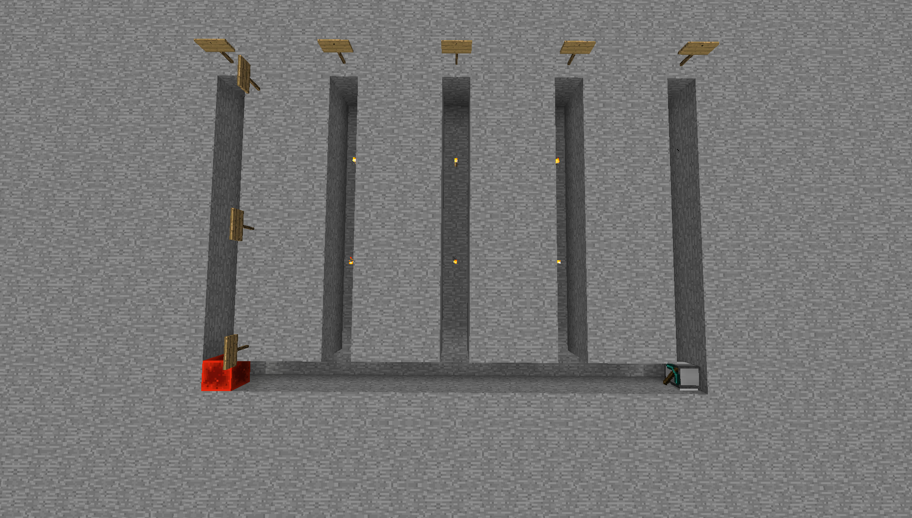
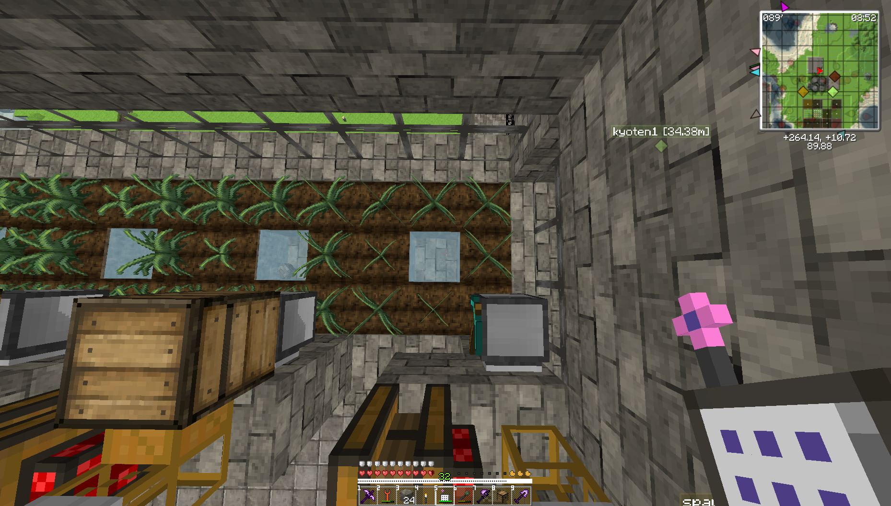
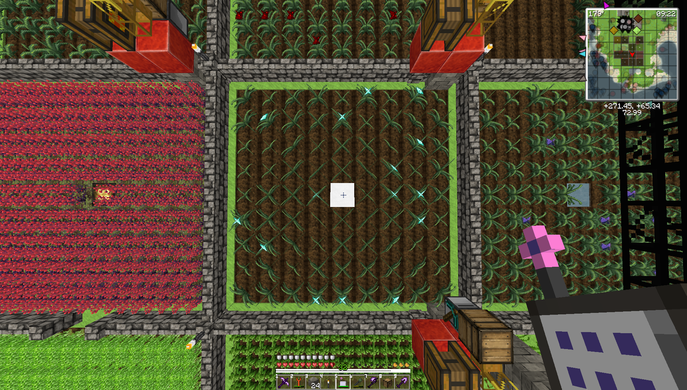
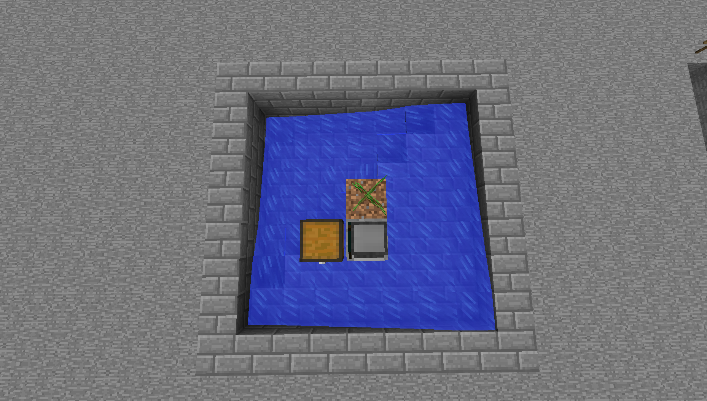
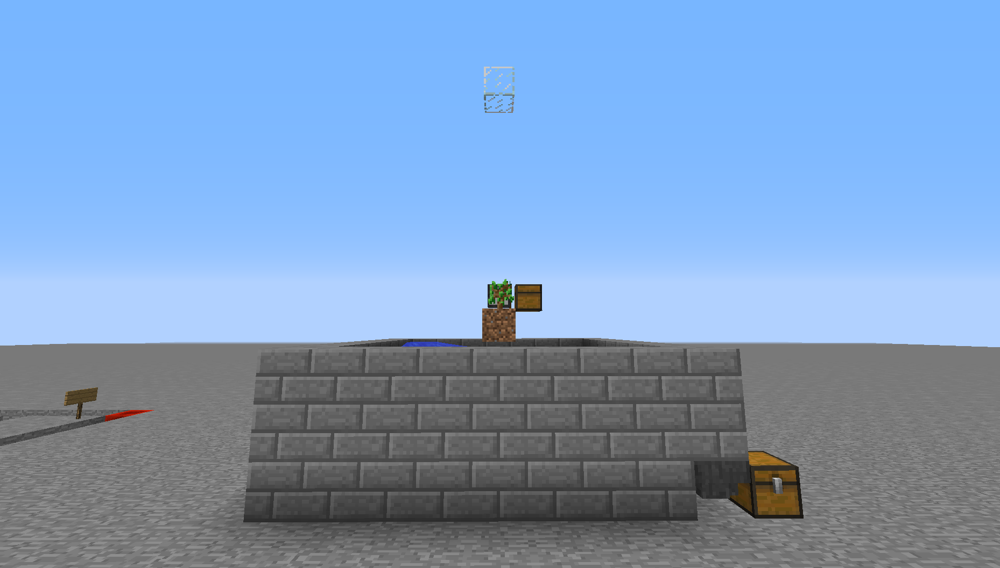
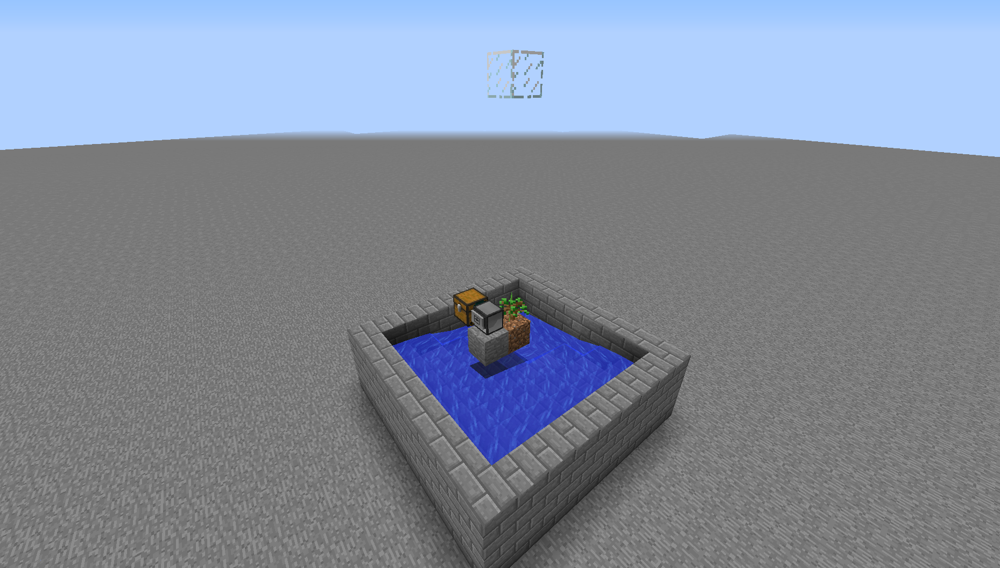
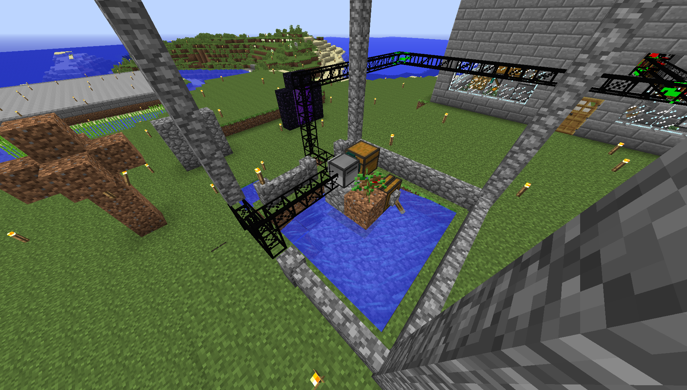

# CC-Programs

これらのプログラムはMinecraftのMod"ComputerCraft"で動作します。  

- [autobranchminer](# autobranchminer)  
- [autoMCFarming](# autoMCFarming)
- [autoMCFarmingA](# autoMCFarmingA)
- [simplelumber](# simplelumber)
- [skystonedigger](# skystonedigger)

## autobranchminer

このプログラムはブランチマイニングをタートルに自動的に行わせるものです。

```
<length>=１本の坑道の長さ
<many>=坑道の数(３ブロック間隔)
<right or left>=タートルの左右に伸ばすかの判断
autobranchminer <length> <many> <right or left>
```

タートルの１番スロットに松明などの光源をあらかじめ入れておくと３ブロック間隔で光源を設置します。

```
autobranchminer 10 5 right
```
実行すると以下のようになります。  
レッドストーンのある位置で画面上方に向いたタートルを動かしたものです。  

  

(サイン、レッドストーンは分かりやすくするために設置したものです)  


## autoMCFarming

このプログラムはMagicalCropsの作物を自動収穫するプログラムです。  

対応する畑の形は決まっています。  

  

```
F=作物
W=水
T=タートル

FFF
FWF
FFT
```

１番スロットに畑に植えられている作物の種をあらかじめ配置する必要があります。  
タートルは畑の１マス上に設置されているものとし、タートルの下に作物が設置されているものとします。  
タートルは画面上方を向いているものとします。  
また動作させるにはタートルの背面にレッドストーン信号が流れていなければなりません。

プログラムが起動するとタートルは下の作物を収穫しながら２ブロック分前進し左に曲がります。  
これをもとの位置に戻るまで繰り返します。  
もとの位置に戻ったら収穫した作物を上面に排出しますので上面にチェストを設置する必要があります
１５分後に再び同じ動作をします。  
また、このプログラムはタートルの背面のレッドストーン信号をOFFにすることでプログラムを停止させることができます。

## autoMCFarmingA

このプログラムは上のautoMCFarmingの広範囲版です。  

これも対応する畑の形が決まっています。  

  

```
F=作物
W=水
T=タートル

FFFFFFFFF
FFFFFFFFF
FFFFFFFFF
FFFFFFFFF
FFFFWFFFF
FFFFFFFFF
FFFFFFFFF
FFFFFFFFF
FFFFFFFFT
```

タートルはautoMCFarmingと同様に設置されています。  
１番スロットに同様に種を配置する必要があります。
レッドストーン信号も同様です。  

プログラムが起動するとタートルは下の作物を収穫しながら８マス分前進し奇数列ならば左の列に移動しながら１８０度回転、偶数列ならば右の列に移動しながら１８０度回転します。  
これをもとの位置に戻るまで繰り返します。
もとの位置に戻ったら３０分後に再び同じ動作をします。  
また、このプログラムはタートルの背面のレッドストーン信号をOFFにすることでプログラムを停止させることができます。  


## simplelumber

このプログラムはタートルに木を自動的に伐採させるものです。  

スロットにはあらかじめ伐採する対象の木の苗木、原木をそれぞれ１番スロット、２番スロットにセットします。

対象の木の原木と比較して伐採するのでModによる追加原木でも伐採可能となります。

対応する伐採場の形が決まっています。  







タートルは苗木が木に成長するのを感知すると伐採を開始します。  
伐採を終えるともとの位置に戻り左側に伐採された木を排出します。

BuildCraft,LogisticsPipesと組み合わせることで使いやすくなります。



## skystonedigger

このプログラムはApplied EnergisticsのmeteoritesからSky Stone Chest'sを採掘するプログラムです。

隕石の中心の真上にタートルをセットし起動させるとSky Stone Chest'sまで採掘します。
